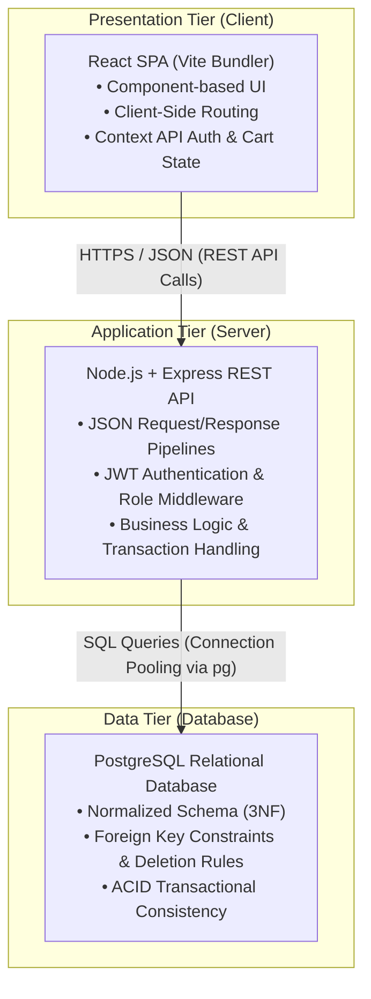
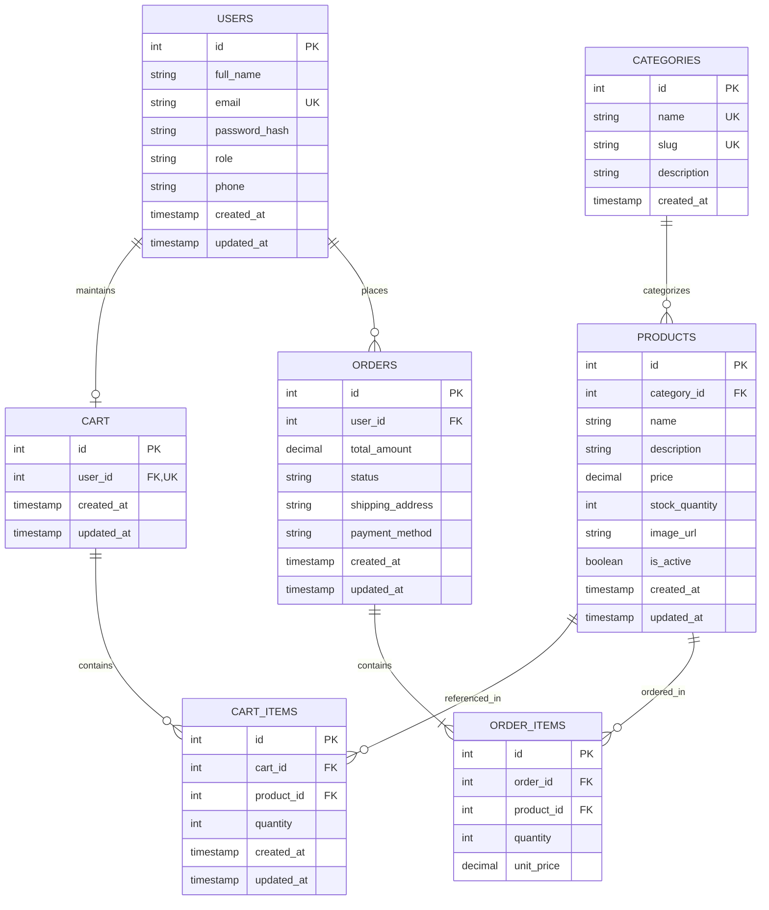

# Sprint 1: System Architecture & Scope Definition

---

### Student & Project Metadata

| Field | Details |
| :--- | :--- |
| **Student Name** | Junaid Ahmed |
| **Roll Number** | 2K23/CSM/54 |
| **Course** | E-Commerce |
| **University** | University of Sindh |
| **Department** | Institute of Mathematics and Computer Science (IMCS) |
| **Project Name** | StudentTech |
| **Project Type** | Student-Focused E-Commerce Platform |
| **Target Market** | University Students in Pakistan |
| **Sprint** | Sprint 1 — System Architecture & Scope Definition |

---

## 1. Target Audience & Market Focus

### Primary Persona
* **Demographic:** Undergraduate and graduate university students in Pakistan (e.g., Computer Science, Software Engineering, IT, and general academic disciplines).
* **Characteristics:** Price-sensitive, technology-dependent for academic coursework, requiring reliable hardware accessories (laptop chargers, USB flash drives, adapters, ergonomic mice, headphones for online lectures) delivered on student-friendly budgets.

### Core Pain Point
University students frequently struggle to source verified, compatible, and affordable computer accessories locally. Generic online marketplaces often present counterfeit items, unpredictable product quality, ambiguous compatibility details, and high shipping surcharges for small accessory orders. StudentTech addresses this by curating essential academic hardware accessories at transparent prices with low-friction ordering.

### Domain Scope
* **Vertical:** Vertical E-Commerce specializing in Student Technology Accessories & Study Hardware.
* **Catalog Focus:** Core computing peripherals, charging solutions, portable data storage, audio accessories for remote learning, and study desk organization tools.

---

## 2. Minimum Viable Product (MVP) Feature Scope

The functional scope of StudentTech is bounded to five core workflows designed for high feasibility and robust implementation within a single academic semester.

| Category | Feature Name | Description | Priority |
| :--- | :--- | :--- | :--- |
| **Authentication** | User Registration & Authentication | Student account creation with email validation, secure password hashing via bcrypt, and stateless session management via JWT. | **High (MVP)** |
| **Catalog** | Product Browsing, Search & Category Filtering | Paginated catalog view, keyword search, and taxonomy-based filtering across accessory categories. | **High (MVP)** |
| **Cart** | Cart Management | Persistent database-backed shopping cart supporting item addition, quantity modification, and item removal with dynamic total calculation. | **High (MVP)** |
| **Checkout** | Checkout & Order Placement | Structured checkout workflow capturing delivery address, selecting payment method (Cash on Delivery / Mock Payment), taking price snapshots, decrementing stock, and generating an order record. | **High (MVP)** |
| **Admin** | Product & Inventory Control | Protected administrative interface for CRUD operations on products, stock level updates, and category management. | **Medium** |

---

## 3. Tech Stack Selection & Justification

```
┌───────────────────────────────────────────────────────────────────┐
│                          STUDENTTECH                              │
│           3-Tier Monolithic Client-Server Architecture            │
├─────────────────┬────────────────────────────────┬────────────────┤
│    Frontend     │            Backend             │    Database    │
│  React 18+ Vite │      Node.js + Express         │   PostgreSQL   │
│  Tailwind / CSS │  JWT Auth + RESTful JSON API   │3NF Relational DB│
└─────────────────┴────────────────────────────────┴────────────────┘
```

### Frontend Framework: React (with Vite)
* **Rationale:** React provides a declarative, component-driven architecture that allows modular UI development for product cards, cart drawers, and administrative tables. Vite provides an optimized development environment using native ES modules for fast Hot Module Replacement (HMR) and lightweight static builds.
* **Alternative Comparison:** *Next.js* was evaluated but rejected because server-side rendering (SSR) and serverless function deployment introduce unnecessary infrastructure complexity for an internal academic single-page application (SPA).

### Backend Infrastructure: Node.js (with Express)
* **Rationale:** Node.js executes JavaScript on the server via the V8 engine, utilizing a non-blocking, event-driven I/O model well-suited for I/O-heavy REST API workloads. Express is a minimalist, unopinionated routing framework that enables explicit middleware pipelines for JWT verification, input validation, and centralized error handling while maintaining a unified language stack across client and server.
* **Alternative Comparison:** *Django (Python)* and *Spring Boot (Java)* were considered; however, Spring Boot introduces high configuration boilerplate, and Django's built-in template/monolithic conventions create impedance with a decoupled SPA architecture, whereas Express provides direct control over RESTful JSON endpoints.

### Database Management System: PostgreSQL
* **Rationale:** PostgreSQL is an enterprise-grade relational database management system (RDBMS) providing strict ACID compliance, declarative schema enforcement, foreign key constraints, and exact fixed-point numeric types (`DECIMAL(10,2)`) essential for financial and inventory data integrity. Structured e-commerce domain models with strong relational dependencies (Users, Orders, Line Items, Carts) map naturally to normalized relational tables.
* **Alternative Comparison:** *MongoDB (NoSQL)* was considered but rejected because its document-oriented model lacks native cross-collection foreign key constraints and schema-level relational guarantees, creating risks of data anomalies in financial transactions and inventory decrements.

### Authentication: JWT + bcrypt
* **Rationale:** Passwords are cryptographically salted and hashed using `bcrypt` before persistence. Authentication utilizes stateless JSON Web Tokens (JWT) transmitted via HTTP Authorization headers, allowing the API server to authenticate protected routes (e.g., `/api/cart`, `/api/orders`, `/api/admin/*`) without maintaining stateful in-memory server session stores.
* **Alternative Comparison:** *Stateful Server Sessions (express-session)* were rejected because they require server-side session stores (such as Redis or database session tables), adding unnecessary state management overhead.

### Caching & Asynchronous Processing: Excluded from MVP
* **Rationale:** In accordance with the assignment manual's "(Optional)" designation, Redis and background task workers (e.g., Celery/BullMQ) are deliberately excluded from the MVP scope. The expected workload does not justify the additional operational complexity of caching layers or distributed background workers.

---

## 4. System Architecture

StudentTech employs a classical **3-Tier Monolithic Client-Server Architecture** communicating over a stateless RESTful JSON interface.



### Layer Responsibilities

1. **Presentation Tier (Client):** Rendered in the user's browser as a React Single-Page Application (SPA). Handles user input, client-side routing, responsive UI views, and asynchronous `fetch`/`axios` calls to backend endpoints.
2. **Application Tier (Server):** Node.js runtime running an Express HTTP server. Exposes structured RESTful endpoints, parses JSON payloads, validates incoming parameters, verifies JWT security tokens, enforces business rules (e.g., stock verification), and coordinates database transactions.
3. **Data Tier (Database):** PostgreSQL relational database instance. Enforces structural domain rules, data types, primary/foreign key integrity, check constraints, unique indexes, and ACID-compliant transaction execution.

---

## 5. Entity-Relationship Diagram (ERD)

The relational schema consists of 7 normalized entities designed to fulfill all e-commerce operations while preventing data anomalies.



---

## 6. Entity Attribute Definitions

All attribute definitions utilize standard, modern PostgreSQL-compliant data types and explicit constraints.

### 6.1 `USERS` Entity
Stores registered student customer and administrative user accounts.

| Attribute | Data Type | Constraints | Description |
| :--- | :--- | :--- | :--- |
| `id` | `INTEGER` | `PRIMARY KEY GENERATED ALWAYS AS IDENTITY` | Unique identifier for the user account |
| `full_name` | `VARCHAR(100)` | `NOT NULL` | Full name of the student or administrator |
| `email` | `VARCHAR(255)` | `NOT NULL, UNIQUE` | Unique academic/personal email address (login credential) |
| `password_hash` | `VARCHAR(255)` | `NOT NULL` | Salted bcrypt cryptographic password hash |
| `role` | `VARCHAR(20)` | `NOT NULL, DEFAULT 'customer'` | Access role: `'customer'` or `'admin'` |
| `phone` | `VARCHAR(20)` | `NULL` | Contact phone number for delivery coordination |
| `created_at` | `TIMESTAMP WITH TIME ZONE` | `NOT NULL, DEFAULT CURRENT_TIMESTAMP` | Account creation timestamp |
| `updated_at` | `TIMESTAMP WITH TIME ZONE` | `NOT NULL, DEFAULT CURRENT_TIMESTAMP` | Profile last update timestamp |

### 6.2 `CATEGORIES` Entity
Organizes the catalog into distinct product classifications (e.g., Chargers, Storage, Audio, Cables).

| Attribute | Data Type | Constraints | Description |
| :--- | :--- | :--- | :--- |
| `id` | `INTEGER` | `PRIMARY KEY GENERATED ALWAYS AS IDENTITY` | Unique identifier for the category |
| `name` | `VARCHAR(100)` | `NOT NULL, UNIQUE` | Display name of the category |
| `slug` | `VARCHAR(100)` | `NOT NULL, UNIQUE` | URL-friendly unique identifier string |
| `description` | `TEXT` | `NULL` | Detailed description of items in this category |
| `created_at` | `TIMESTAMP WITH TIME ZONE` | `NOT NULL, DEFAULT CURRENT_TIMESTAMP` | Record creation timestamp |

### 6.3 `PRODUCTS` Entity
Contains catalog items available for browsing and purchasing.

| Attribute | Data Type | Constraints | Description |
| :--- | :--- | :--- | :--- |
| `id` | `INTEGER` | `PRIMARY KEY GENERATED ALWAYS AS IDENTITY` | Unique identifier for the product |
| `category_id` | `INTEGER` | `NOT NULL, REFERENCES CATEGORIES(id) ON DELETE RESTRICT` | Foreign key linking product to its primary category |
| `name` | `VARCHAR(200)` | `NOT NULL` | Commercial name of the accessory |
| `description` | `TEXT` | `NULL` | Technical specifications and item description |
| `price` | `DECIMAL(10, 2)` | `NOT NULL, CHECK (price >= 0.00)` | Current catalog retail price in PKR |
| `stock_quantity` | `INTEGER` | `NOT NULL, DEFAULT 0, CHECK (stock_quantity >= 0)` | Available physical inventory count |
| `image_url` | `VARCHAR(500)` | `NULL` | Relative or absolute path to product photograph |
| `is_active` | `BOOLEAN` | `NOT NULL, DEFAULT TRUE` | Soft-deletion flag controlling catalog visibility |
| `created_at` | `TIMESTAMP WITH TIME ZONE` | `NOT NULL, DEFAULT CURRENT_TIMESTAMP` | Item addition timestamp |
| `updated_at` | `TIMESTAMP WITH TIME ZONE` | `NOT NULL, DEFAULT CURRENT_TIMESTAMP` | Item last modification timestamp |

### 6.4 `CART` Entity
Represents an active, persistent shopping cart instance for a registered user.

| Attribute | Data Type | Constraints | Description |
| :--- | :--- | :--- | :--- |
| `id` | `INTEGER` | `PRIMARY KEY GENERATED ALWAYS AS IDENTITY` | Unique identifier for the cart |
| `user_id` | `INTEGER` | `NOT NULL, UNIQUE, REFERENCES USERS(id) ON DELETE CASCADE` | Foreign key enforcing at most one active cart per registered user |
| `created_at` | `TIMESTAMP WITH TIME ZONE` | `NOT NULL, DEFAULT CURRENT_TIMESTAMP` | Cart initialization timestamp |
| `updated_at` | `TIMESTAMP WITH TIME ZONE` | `NOT NULL, DEFAULT CURRENT_TIMESTAMP` | Cart last modification timestamp |

### 6.5 `CART_ITEMS` Entity
Associative entity resolving the many-to-many relationship between `CART` and `PRODUCTS`.

| Attribute | Data Type | Constraints | Description |
| :--- | :--- | :--- | :--- |
| `id` | `INTEGER` | `PRIMARY KEY GENERATED ALWAYS AS IDENTITY` | Unique identifier for the cart item entry |
| `cart_id` | `INTEGER` | `NOT NULL, REFERENCES CART(id) ON DELETE CASCADE` | Foreign key referencing the parent cart |
| `product_id` | `INTEGER` | `NOT NULL, REFERENCES PRODUCTS(id) ON DELETE RESTRICT` | Foreign key referencing the selected product (restricted because products use `is_active` soft-deletion) |
| `quantity` | `INTEGER` | `NOT NULL, DEFAULT 1, CHECK (quantity > 0)` | Number of product units in the cart |
| `created_at` | `TIMESTAMP WITH TIME ZONE` | `NOT NULL, DEFAULT CURRENT_TIMESTAMP` | Item addition timestamp |
| `updated_at` | `TIMESTAMP WITH TIME ZONE` | `NOT NULL, DEFAULT CURRENT_TIMESTAMP` | Quantity update timestamp |
| *Composite Rule* | `UNIQUE (cart_id, product_id)` | `TABLE CONSTRAINT` | Ensures a product appears only once per cart |

### 6.6 `ORDERS` Entity
Represents a persistent historical purchase record whose financial transaction values are preserved, while operational lifecycle attributes (such as order status) transition over time.

| Attribute | Data Type | Constraints | Description |
| :--- | :--- | :--- | :--- |
| `id` | `INTEGER` | `PRIMARY KEY GENERATED ALWAYS AS IDENTITY` | Unique identifier for the order |
| `user_id` | `INTEGER` | `NOT NULL, REFERENCES USERS(id) ON DELETE RESTRICT` | Foreign key referencing the purchaser |
| `total_amount` | `DECIMAL(10, 2)` | `NOT NULL, CHECK (total_amount >= 0.00)` | Finalized financial total charged for the order in PKR, persisted at checkout settlement |
| `status` | `VARCHAR(30)` | `NOT NULL, DEFAULT 'PENDING'` | Lifecycle status: `'PENDING'`, `'PAID'`, `'SHIPPED'`, `'DELIVERED'`, `'CANCELLED'` |
| `shipping_address` | `TEXT` | `NOT NULL` | Physical campus/hostel/home delivery destination |
| `payment_method` | `VARCHAR(50)` | `NOT NULL, DEFAULT 'COD'` | Selected payment channel: `'COD'` (Cash on Delivery) or `'MOCK_CARD'` (Simulated Payment) |
| `created_at` | `TIMESTAMP WITH TIME ZONE` | `NOT NULL, DEFAULT CURRENT_TIMESTAMP` | Order placement timestamp |
| `updated_at` | `TIMESTAMP WITH TIME ZONE` | `NOT NULL, DEFAULT CURRENT_TIMESTAMP` | Status change timestamp |

### 6.7 `ORDER_ITEMS` Entity
Associative entity capturing the purchased items and preserved unit price snapshots associated with an order.

| Attribute | Data Type | Constraints | Description |
| :--- | :--- | :--- | :--- |
| `id` | `INTEGER` | `PRIMARY KEY GENERATED ALWAYS AS IDENTITY` | Unique identifier for the line item |
| `order_id` | `INTEGER` | `NOT NULL, REFERENCES ORDERS(id) ON DELETE CASCADE` | Foreign key referencing the parent order |
| `product_id` | `INTEGER` | `NOT NULL, REFERENCES PRODUCTS(id) ON DELETE RESTRICT` | Foreign key referencing the purchased product |
| `quantity` | `INTEGER` | `NOT NULL, CHECK (quantity > 0)` | Number of units purchased |
| `unit_price` | `DECIMAL(10, 2)` | `NOT NULL, CHECK (unit_price >= 0.00)` | Historical price snapshot at the moment of checkout |

#### Critical Architectural Design Decision: `unit_price` Snapshot vs. Derived `subtotal` vs. `ORDERS.total_amount`
* **`unit_price` is explicitly stored in `ORDER_ITEMS`:** In an e-commerce catalog, product prices fluctuate over time due to supplier updates, seasonal discounts, or inflation. If order line items queried `PRODUCTS.price` dynamically, historical orders would retrospectively alter whenever catalog prices change. Storing `unit_price` freezes the exact per-unit contract agreed upon at the time of purchase.
* **Line-item `subtotal` is omitted from storage:** In relational database design (3NF), storing a derived attribute calculated strictly from existing columns within the exact same row (`quantity * unit_price`) introduces redundant data and update anomalies. Line-item subtotals are computed dynamically via SQL expressions (`(quantity * unit_price) AS subtotal`) at query time.
* **`ORDERS.total_amount` is persisted:** Unlike volatile line-item calculations, `ORDERS.total_amount` represents the finalized order-level financial transaction total agreed upon and settled at checkout. In real-world and academic transactional schemas, persisting the finalized transaction total preserves the recorded transaction value independently of any subsequent catalog pricing modifications, providing a preserved financial audit trail without violating normalization principles for transactional systems.

---

## 7. Relationship & Cardinality Specification

| Entity Relationship | Cardinality | Exact Structural Meaning |
| :--- | :--- | :--- |
| **`Users` → `Cart`** | `1 : 0..1` | A registered user has at most one active cart. The `user_id` column in `CART` is constrained as `UNIQUE`, enforcing an optional one-to-one relationship. |
| **`Cart` → `Cart_Items`** | `1 : 0..N` | A cart may be empty or contain multiple line items. Each `Cart_Item` row belongs exclusively to one parent `Cart`. |
| **`Products` → `Cart_Items`** | `1 : 0..N` | A product may be added into zero, one, or multiple active carts across different users. |
| **`Users` → `Orders`** | `1 : 0..N` | A user can place zero orders (new user) or multiple sequential orders over time. Each order is placed by exactly one user. |
| **`Orders` → `Order_Items`** | `1 : 1..N` | An order represents a valid transaction and must contain at least one line item. Each line item belongs strictly to one order. |
| **`Products` → `Order_Items`** | `1 : 0..N` | A product may be ordered zero times (new inventory) or appear in multiple historical order records. |
| **`Categories` → `Products`** | `1 : 0..N` | A category classifies zero or many products. Each product belongs to exactly one category via `category_id`. |

### Resolution of Many-to-Many Relationships
In relational database design, a conceptual many-to-many ($N:M$) relationship is resolved through an associative entity/table so that each relationship instance is represented as a separate atomic row while preserving referential integrity and normalization:
1. **`Cart` $\leftrightarrow$ `Products` ($N:M$)** is resolved through **`CART_ITEMS`**, which maintains composite integrity via `UNIQUE(cart_id, product_id)` and tracks item quantities.
2. **`Orders` $\leftrightarrow$ `Products` ($N:M$)** is resolved through **`ORDER_ITEMS`**, which binds each purchased product to the order while preserving the historical unit purchase price.

---

## 8. Normalization & Data Integrity

The StudentTech database schema is designed in accordance with **Third Normal Form (3NF)**, with intentional transactional snapshot fields where historical financial preservation is required:

1. **First Normal Form (1NF):** Every table possesses an explicit primary key (`id`), and all column attributes contain atomic (indivisible) values with no repeating groups or multi-valued arrays.
2. **Second Normal Form (2NF):** The schema satisfies 1NF, and all non-key attributes are fully functionally dependent on the primary key. In entities with single-column primary keys (`USERS`, `CATEGORIES`, `PRODUCTS`, `CART`, `ORDERS`), partial key dependencies are mathematically impossible. In associative entities (`CART_ITEMS`, `ORDER_ITEMS`), non-key attributes (`quantity`, `unit_price`, timestamps) directly describe the entity instance identified by the surrogate primary key, while business-level uniqueness constraints (such as `UNIQUE(cart_id, product_id)`) prevent duplicate associations without introducing partial functional dependencies.
3. **Third Normal Form (3NF):** The schema satisfies 2NF, and no non-key attribute is transitively dependent on the primary key. Category metadata is isolated in `CATEGORIES` rather than duplicated across `PRODUCTS`; customer profile information is isolated in `USERS` rather than repeated across `ORDERS`; and transient line-item subtotals are calculated dynamically. Furthermore, persisting `ORDERS.total_amount` (the finalized transaction value recorded at settlement) and `ORDER_ITEMS.unit_price` preserves the agreed-upon financial contract independently of subsequent catalog price alterations, providing a preserved financial audit trail as required in transactional e-commerce systems.

### Declarative Integrity Constraints
* **Entity & Referential Integrity:** All tables use integer identity primary keys. Foreign keys utilize explicit deletion policies: `ON DELETE CASCADE` removes dependent cart rows when a parent user or cart is deleted; `ON DELETE RESTRICT` protects historical orders (`ORDERS.user_id`, `ORDER_ITEMS.product_id`), referenced active cart products (`CART_ITEMS.product_id`), and active product categories (`PRODUCTS.category_id`) from accidental physical deletion, directly supporting the `PRODUCTS.is_active` soft-deletion strategy.
* **Domain & Check Constraints:** Numeric validations enforce strict non-negativity: `CHECK (price >= 0.00)`, `CHECK (stock_quantity >= 0)`, `CHECK (quantity > 0)`, `CHECK (total_amount >= 0.00)`, and `CHECK (unit_price >= 0.00)`.
* **Uniqueness Guarantees:** Unique indexes on `USERS.email`, `CATEGORIES.name`, `CATEGORIES.slug`, and `CART.user_id` prevent duplicate identity and catalog data.
* **Deduplication:** A composite unique constraint on `CART_ITEMS(cart_id, product_id)` guarantees that adding an existing item to a cart increments the `quantity` attribute rather than inserting duplicate rows.

---

## 9. Scope Boundaries (Out of Scope for MVP)

To ensure high feasibility within the academic timeline, the following advanced capabilities are explicitly defined as **outside the Sprint 1 MVP scope**:

* **Production Payment Gateway Integrations:** No live third-party payment APIs (e.g., live Stripe, PayFast, or production bank gateways). Transactions are fulfilled via Cash on Delivery (COD) or simulated mock payment handlers.
* **Product Reviews & User Ratings:** User-submitted reviews, star ratings, and moderation queues are deferred to subsequent sprints.
* **Customer Wishlists & Saved Items:** Saved-for-later lists and multi-cart functionality are excluded.
* **Recommendation Algorithms & AI Search:** No machine learning, collaborative filtering, or vector search engines.
* **Live Courier & GPS Shipment Tracking:** External courier API integration (e.g., TCS/T&T tracking webhooks) is excluded; order progression is handled via internal administrative status transitions.
* **Distributed Caching & Message Brokers:** No Redis, Memcached, RabbitMQ, or Apache Kafka infrastructure.
* **Microservices Architecture:** No distributed service discovery, API gateways, or container orchestration (Kubernetes); the system is architected as a clean 3-tier monolith.

---

## 10. Sprint 1 Deliverable Checklist

| Requirement / Deliverable | Status | Location / Reference |
| :--- | :--- | :--- |
| **Student Information Header** | Complete | Document Header Metadata Table |
| **Target Audience & Persona** | Complete | Section 1 (Target Audience & Market Focus) |
| **Core Pain Point & Domain** | Complete | Section 1 (Target Audience & Market Focus) |
| **MVP Feature Scope Matrix** | Complete | Section 2 (5 Core Workflows Defined) |
| **Tech Stack Justification** | Complete | Section 3 (Frontend, Backend, Database, Auth, Caching) |
| **System Architecture Diagram** | Complete | Section 4 (3-Tier Monolith Flowchart in Mermaid.js) |
| **Entity-Relationship Diagram** | Complete | Section 5 (7 Entities & Relationships in Mermaid.js) |
| **Entity Attribute Definitions** | Complete | Section 6 (PostgreSQL Data Types & Constraints) |
| **Historical Price Snapshot Defense** | Complete | Section 6.7 (`ORDER_ITEMS.unit_price` & `ORDERS.total_amount` defense) |
| **Cardinality & Relationship Table** | Complete | Section 7 (Exact `1:0..1`, `1:0..N`, `1:1..N` Mappings) |
| **Normalization Analysis (3NF)** | Complete | Section 8 (1NF, 2NF, 3NF & Integrity Rules) |
| **Scope Boundaries Defined** | Complete | Section 9 (Explicit Out-of-Scope Capabilities) |

---
*End of Sprint 1 Architecture & Scope Definition Specification.*
