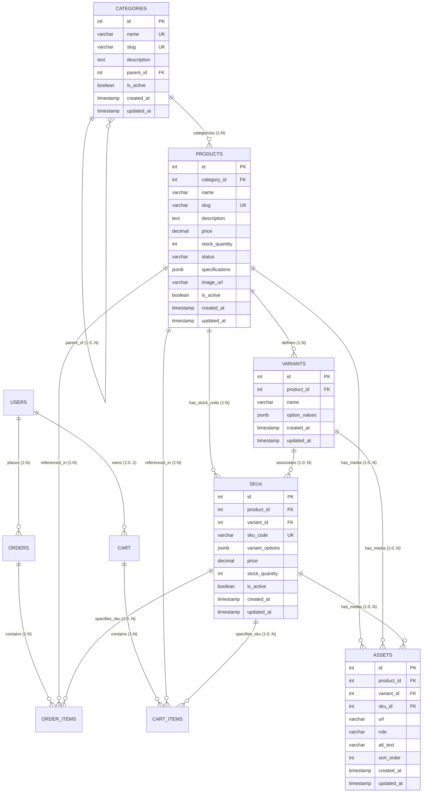

# Sprint 2 Submission Document: Catalog Data Foundation

**Project:** StudentTech  
**Student Name:** Junaid Ahmed  
**Roll Number:** 2K23/CSM/54  
**Course:** E-Commerce  
**Department:** Institute of Mathematics and Computer Science (IMCS)  
**University:** University of Sindh  
**Sprint:** Sprint 2 — Catalog Data Foundation  
**Repository Branch:** `main`  
**Architecture:** 3-Tier Monolithic Client-Server (React + Express + PostgreSQL)

---

## 1. Executive Summary & Sprint Scope

Sprint 2 establishes the **Catalog Data Foundation** for **StudentTech**, an e-commerce platform tailored for university students in Pakistan. Building upon the baseline relational model established in Sprint 1, Sprint 2 transforms the catalog from simple single-item records into an enterprise-grade **multi-variant SKU architecture** with hierarchical category taxonomies, dynamic JSONB technical specifications, media asset mappings, and an authenticated administrative REST API.

### Core Objectives Delivered:
1. **Multi-Variant Catalog Relational Foundation:** Normalized database schema extending products to support multi-dimensional variant attributes (e.g., Switch Type $\times$ Color), independent sellable SKUs with separate prices and inventory, and polymorphic media assets.
2. **Authenticated Administrative REST API:** Monolithic Express API under `/api/v1/admin` providing full CRUD lifecycle management for categories, products, variants, and SKUs, secured via JWT authentication and role-based access control.
3. **Idempotent Seed Data:** Realistic Pakistani student tech catalog containing hierarchical categories, multi-attribute products, and sellable SKUs with PKR pricing and clean omission-based representation of unavailable variant combinations.
4. **Automated Verification Suite:** 33 passing automated integration and constraint tests validating authentication gates, domain business rules, cycle prevention, and foreign-key integrity.

---

## 2. Relational Database Architecture & Entity Relationships

The Sprint 2 database design extends the Sprint 1 baseline schema through modular, sequential SQL migrations without breaking existing tables or downstream relations.

### 2.1 Entity Relationship Diagram (ERD)



### 2.2 Table Schema Specifications & Constraints

#### 1. `categories` (Extended)
- `id`: `INTEGER PRIMARY KEY GENERATED ALWAYS AS IDENTITY`
- `name`: `VARCHAR(100) NOT NULL UNIQUE`
- `slug`: `VARCHAR(100) NOT NULL UNIQUE` — URL-safe lowercase slug
- `description`: `TEXT NULL`
- `parent_id`: `INTEGER NULL REFERENCES categories(id) ON DELETE RESTRICT` — Enables recursive category nesting
- `is_active`: `BOOLEAN NOT NULL DEFAULT TRUE`
- **Constraint:** `check_category_parent_not_self`: `CHECK (parent_id IS NULL OR parent_id <> id)`

#### 2. `products` (Extended)
- `id`: `INTEGER PRIMARY KEY GENERATED ALWAYS AS IDENTITY`
- `category_id`: `INTEGER NOT NULL REFERENCES categories(id) ON DELETE RESTRICT`
- `name`: `VARCHAR(200) NOT NULL`
- `slug`: `VARCHAR(200) NOT NULL UNIQUE`
- `description`: `TEXT NULL`
- `price`: `DECIMAL(10, 2) NOT NULL` — Baseline display price (`CHECK (price >= 0.00)`)
- `stock_quantity`: `INTEGER NOT NULL DEFAULT 0` (`CHECK (stock_quantity >= 0)`)
- `status`: `VARCHAR(20) NOT NULL DEFAULT 'draft'` (`CHECK (status IN ('draft', 'published', 'archived'))`)
- `specifications`: `JSONB NOT NULL DEFAULT '{}'::jsonb` (`CHECK (jsonb_typeof(specifications) = 'object')`)
- `is_active`: `BOOLEAN NOT NULL DEFAULT TRUE`

#### 3. `variants` (New)
- `id`: `INTEGER PRIMARY KEY GENERATED ALWAYS AS IDENTITY`
- `product_id`: `INTEGER NOT NULL REFERENCES products(id) ON DELETE CASCADE`
- `name`: `VARCHAR(100) NOT NULL` (e.g., `'Switch Type'`, `'Color'`, `'Plug Type'`)
- `option_values`: `JSONB NOT NULL DEFAULT '[]'::jsonb` (`CHECK (jsonb_typeof(option_values) = 'array')`)
- **Constraint:** `uq_product_variant_name`: `UNIQUE (product_id, name)`

#### 4. `skus` (New)
- `id`: `INTEGER PRIMARY KEY GENERATED ALWAYS AS IDENTITY`
- `product_id`: `INTEGER NOT NULL REFERENCES products(id) ON DELETE RESTRICT`
- `variant_id`: `INTEGER NULL REFERENCES variants(id) ON DELETE SET NULL`
- `sku_code`: `VARCHAR(50) NOT NULL UNIQUE` (e.g., `'ST-KB-75-BRN-BLK'`)
- `variant_options`: `JSONB NOT NULL DEFAULT '{}'::jsonb` (e.g., `{"Switch Type": "Tactile Brown", "Color": "Matte Black"}`)
- `price`: `DECIMAL(10, 2) NOT NULL` (`CHECK (price >= 0.00)`)
- `stock_quantity`: `INTEGER NOT NULL DEFAULT 0` (`CHECK (stock_quantity >= 0)`)
- `is_active`: `BOOLEAN NOT NULL DEFAULT TRUE`
- **Constraint:** `uq_product_variant_options`: `UNIQUE (product_id, variant_options)`

#### 5. `assets` (New)
- `id`: `INTEGER PRIMARY KEY GENERATED ALWAYS AS IDENTITY`
- `product_id`: `INTEGER NULL REFERENCES products(id) ON DELETE CASCADE`
- `variant_id`: `INTEGER NULL REFERENCES variants(id) ON DELETE SET NULL`
- `sku_id`: `INTEGER NULL REFERENCES skus(id) ON DELETE SET NULL`
- `url`: `VARCHAR(500) NOT NULL`
- `role`: `VARCHAR(20) NOT NULL DEFAULT 'detail'` (`CHECK (role IN ('hero', 'detail', 'swatch'))`)
- `alt_text`: `VARCHAR(255) NULL`
- `sort_order`: `INTEGER NOT NULL DEFAULT 0`
- **Constraint:** `check_asset_owner`: `CHECK (product_id IS NOT NULL OR variant_id IS NOT NULL OR sku_id IS NOT NULL)`

#### 6. Downstream Compatibility Linkage (`cart_items` & `order_items`)
- `cart_items.sku_id`: `INTEGER NULL REFERENCES skus(id) ON DELETE RESTRICT`
- `order_items.sku_id`: `INTEGER NULL REFERENCES skus(id) ON DELETE RESTRICT`

---

## 3. Authenticated Administrative REST API Specification

All administrative API endpoints are mounted under `/api/v1/admin` and require an `Authorization: Bearer <token>` header carrying a verified JWT with claim `role: "admin"`.

### 3.1 Endpoint Summary Table

| HTTP Method | Route | Description | Auth & Role | Success Code |
| :--- | :--- | :--- | :--- | :--- |
| `GET` | `/health` | Server liveness & health check | Public | `200 OK` |
| `POST` | `/api/v1/admin/categories` | Create root or nested child category | Admin JWT | `201 Created` |
| `GET` | `/api/v1/admin/categories` | Retrieve hierarchical category tree | Admin JWT | `200 OK` |
| `POST` | `/api/v1/admin/products` | Create new product in `draft` status | Admin JWT | `201 Created` |
| `GET` | `/api/v1/admin/products` | List products with aggregated SKU summary | Admin JWT | `200 OK` |
| `PATCH` | `/api/v1/admin/products/:id` | Update metadata or lifecycle status | Admin JWT | `200 OK` |
| `POST` | `/api/v1/admin/products/:id/variants` | Define variant attribute (e.g. Color) | Admin JWT | `201 Created` |
| `GET` | `/api/v1/admin/products/:id/variants` | List variant definitions for product | Admin JWT | `200 OK` |
| `POST` | `/api/v1/admin/products/:id/skus` | Create sellable SKU with variant options | Admin JWT | `201 Created` |
| `PATCH` | `/api/v1/admin/skus/:id` | Update SKU price, stock, or active state | Admin JWT | `200 OK` |

### 3.2 Error Envelope & HTTP Status Code Mapping

All error responses strictly follow the standardized envelope:

```json
{
  "error": {
    "code": "VALIDATION_ERROR",
    "message": "Cannot publish product without at least one active sellable SKU.",
    "details": null
  }
}
```

| HTTP Status | Error Code | Trigger Condition |
| :--- | :--- | :--- |
| `400 Bad Request` | `VALIDATION_ERROR` | Missing required fields, negative price/stock, invalid JSON, or invalid CAT-04 variant options |
| `401 Unauthorized` | `UNAUTHORIZED` | Missing, expired, or cryptographically invalid JWT Bearer token |
| `403 Forbidden` | `FORBIDDEN` | Authenticated user lacks `admin` role (`role !== 'admin'`) |
| `404 Not Found` | `NOT_FOUND` | Non-existent category parent ID, product ID, variant ID, or SKU ID |
| `409 Conflict` | `CONFLICT_ERROR` | Duplicate category slug, duplicate product slug, duplicate SKU code, or duplicate variant combination |
| `500 Internal Error` | `INTERNAL_ERROR` | Unhandled server or database exceptions |

---

## 4. Idempotent Seed Data Architecture & Catalog Representation

The seed script (`src/database/seed.js`) populates realistic Pakistani university student technology products.

### 4.1 Seeded Taxonomy & Products

```
1. Computing & Study Hardware (Parent Category)
   └── Mechanical Keyboards & Input (Child Category)
       └── Product: StudentPro Ergonomic 75% Mechanical Keyboard
           ├── Variant 1: Switch Type -> ["Tactile Brown", "Silent Red", "Clicky Blue"]
           ├── Variant 2: Color -> ["Matte Black", "Arctic White"]
           ├── SKU: ST-KB-75-BRN-BLK (Brown / Black) -> PKR 4,999.00 (Stock: 25)
           ├── SKU: ST-KB-75-RED-WHT (Red / White)   -> PKR 5,299.00 (Stock: 15)
           └── SKU: ST-KB-75-BLU-BLK (Blue / Black)  -> PKR 4,799.00 (Stock: 20)

2. Power & Audio Essentials (Parent Category)
   ├── Fast Chargers & Power Adapters (Child Category)
   │   └── Product: UniPower 65W GaN Multi-Port Fast Charger
   │       ├── Variant: Plug Type -> ["UK 3-Pin (Pakistan Standard)", "EU 2-Pin"]
   │       ├── SKU: ST-CHG-65W-UK (UK 3-Pin) -> PKR 2,850.00 (Stock: 40)
   │       └── SKU: ST-CHG-65W-EU (EU 2-Pin) -> PKR 2,850.00 (Stock: 15)
   └── Product: AcousticShield Pro ANC Study Headset (Direct in Parent Category)
       ├── Variant: Color -> ["Midnight Black", "Silver Gray"]
       └── SKU: ST-AUD-ANC-BLK (Midnight Black) -> PKR 3,999.00 (Stock: 30)
```

### 4.2 Relational Representation of Unavailable Variant Combinations

In relational catalog modeling, defining a product with $M$ options across $N$ variant attributes creates a Cartesian product of theoretically possible combinations ($3 \text{ Switch Types} \times 2 \text{ Colors} = 6 \text{ possible combinations}$).

**Design Decision:**
- Unavailable or unmanufactured combinations (e.g., `{"Switch Type": "Clicky Blue", "Color": "Arctic White"}`) are represented by **omitting the corresponding record from the `skus` table**.
- **No fake SKUs, negative inventory, or placeholder flags are created.**
- If a customer or API selects an option combination that has no corresponding SKU row in `skus`, the business layer determines that the combination is not offered.
- This maintains clean 3NF database normalization, prevents inventory distortion, and adheres to e-commerce industry best practices.

### 4.3 Idempotency & Seed Execution

The seed script is executed via:
```bash
npm run seed
```
- Uses `INSERT ... ON CONFLICT (slug) DO UPDATE` and `INSERT ... ON CONFLICT (sku_code) DO UPDATE`.
- Operates inside an explicit database transaction (`BEGIN` / `COMMIT` / `ROLLBACK`).
- Running the script repeatedly produces identical row counts (4 categories, 3 products, 4 variant definitions, 6 SKUs) with zero duplication or constraint errors.

---

## 5. Verification, Test Execution & Database Status

### 5.1 Test Execution Results

All 33 automated integration and schema tests executed and passed:

```text
> studenttech@1.0.0 test
> node src/database/validate_schema.js && node test/admin_api.test.js

=====================================================
--- Validating PostgreSQL Schema & Migrations ---
=====================================================

[1/4] Applying SQL Migrations sequentially:
  -> Executing 001_sprint1_initial_schema.sql... ✔
  -> Executing 002_sprint2_catalog_foundation.sql... ✔
[2/4] Verifying Table Existence: ✔ (10/10 tables verified)
[3/4] Testing Data Insertion & Hierarchical Relationships: ✔ Passed
[4/4] Verifying Business Constraints & Rejection Rules: ✔ Passed

=====================================================
--- StudentTech Sprint 2 Admin API Verification ---
=====================================================

  ✔ PASS: Health check endpoint GET /health returns 200 OK
  ✔ PASS: Reject unauthenticated request to admin endpoint with 401 UNAUTHORIZED
  ✔ PASS: Reject invalid/malformed JWT token with 401 UNAUTHORIZED
  ✔ PASS: Reject expired JWT token with 401 UNAUTHORIZED
  ✔ PASS: Reject customer role user from admin endpoint with 403 FORBIDDEN
  ✔ PASS: Admin can create root category (Technology & Computing)
  ✔ PASS: Admin can create nested child category (Peripherals)
  ✔ PASS: Admin can create 3rd level subcategory (Mechanical Keyboards)
  ✔ PASS: Reject duplicate category slug with 409 CONFLICT_ERROR
  ✔ PASS: Reject category creation referencing non-existent parent_id with 404 NOT_FOUND
  ✔ PASS: Reject self-parenting and multi-level cyclic hierarchies in category service
  ✔ PASS: Admin can retrieve full hierarchical category tree with children nesting
  ✔ PASS: Admin can create product in default DRAFT status
  ✔ PASS: Reject duplicate product slug with 409 CONFLICT_ERROR
  ✔ PASS: Reject publishing a product without active sellable SKUs
  ✔ PASS: Admin can create variant definition (Switch Type)
  ✔ PASS: Admin can create second variant definition (Chassis Color)
  ✔ PASS: Reject duplicate variant definition on same product with 409 CONFLICT_ERROR
  ✔ PASS: Admin can list all variants defined for a product
  ✔ PASS: Admin can create valid SKU with variant options
  ✔ PASS: Admin can create second SKU with different variant options
  ✔ PASS: Reject SKU creation with negative price
  ✔ PASS: Reject SKU creation with negative stock quantity
  ✔ PASS: Reject SKU with invalid variant option value not in defined variant (CAT-04)
  ✔ PASS: Reject duplicate SKU code with 409 CONFLICT_ERROR
  ✔ PASS: Reject duplicate variant combination on same product with 409 CONFLICT_ERROR
  ✔ PASS: Publish product now that active sellable SKUs exist
  ✔ PASS: Admin can list products with aggregated SKU summary (total SKUs, price range, total inventory)
  ✔ PASS: Admin can update SKU price, stock quantity, and active status directly
  ✔ PASS: Reject SKU update with negative price
  ✔ PASS: Reject SKU update for non-existent SKU with 404 NOT_FOUND
  ✔ PASS: Downstream Cart Item and Order Item tables support valid SKU linkage
  ✔ PASS: Catalog seed script executes cleanly and is strictly idempotent on reruns

=====================================================
Results: 33 passed, 0 failed
=====================================================
```

### 5.2 Test Environment & Database Integration Clarification

- **In-Memory Harness (`pg-mem`):** The automated test suite (`npm test`) executes using `pg-mem`, an in-memory PostgreSQL engine. `pg-mem` parses and executes the exact SQL migration files (`001_sprint1_initial_schema.sql` and `002_sprint2_catalog_foundation.sql`), verifying constraint violations, foreign-key rules, transactions, and API routes hermetically.
- **Real Database Status:** On the local development host, a live PostgreSQL daemon / Docker service was not running.
- **Executing on Real PostgreSQL:** When a real PostgreSQL instance is available, the schema, seed, and server can be run against it using standard commands:
  ```bash
  # 1. Copy environment template and configure DATABASE_URL
  cp .env.example .env

  # 2. Run schema migrations
  npm run migrate

  # 3. Seed catalog data
  npm run seed

  # 4. Start the API server
  npm start
  ```

---

## 6. Sprint 1 Compatibility & Intentional Decisions

1. **Migration Preservation:** `001_sprint1_initial_schema.sql` was preserved in its entirety. Sprint 2 migrations were added in `002_sprint2_catalog_foundation.sql` using standard `ALTER TABLE` and `CREATE TABLE IF NOT EXISTS` statements.
2. **Nullable Downstream Foreign Keys:** `cart_items.sku_id` and `order_items.sku_id` were added as nullable foreign keys with `ON DELETE RESTRICT`. This preserves existing Sprint 1 cart/order functionality while enabling granular SKU tracking for Sprint 3+.
3. **Decimal Price Representation:** Financial values use `DECIMAL(10, 2)` across all products and SKUs, formatted via `.toFixed(2)` to avoid floating-point inaccuracies.
4. **Draft-First State Machine:** Products must be created as `'draft'` and can only transition to `'published'` once at least one active SKU is configured, preventing customers from viewing unorderable products.

---

## 7. Out-of-Scope & Future Sprint Roadmap

The following capabilities are deliberately excluded from Sprint 2 and scheduled for subsequent sprints:

| Feature Area | Scheduled Sprint | Description |
| :--- | :--- | :--- |
| **Public Storefront UI** | Sprint 3 | React + Vite customer catalog browsing, faceted filtering, and search |
| **Cloud Media Pipeline** | Sprint 3 | S3/Cloudinary direct image uploads and thumbnail generation |
| **Customer Cart & Checkout** | Sprint 4 | Multi-item cart management with SKU selection, address capture, and Cash-on-Delivery (COD) checkout |
| **Order Processing & Admin Fulfillment**| Sprint 5 | Administrative order state management, tracking updates, and financial settlement |
